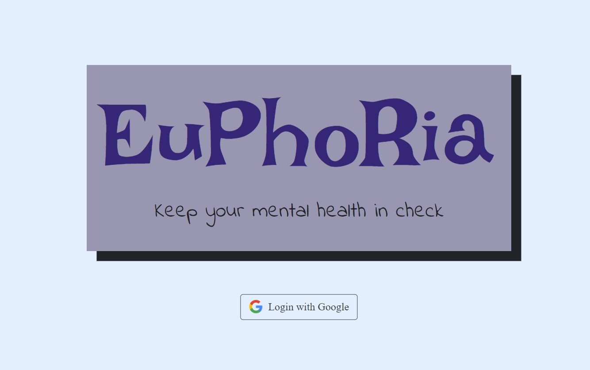
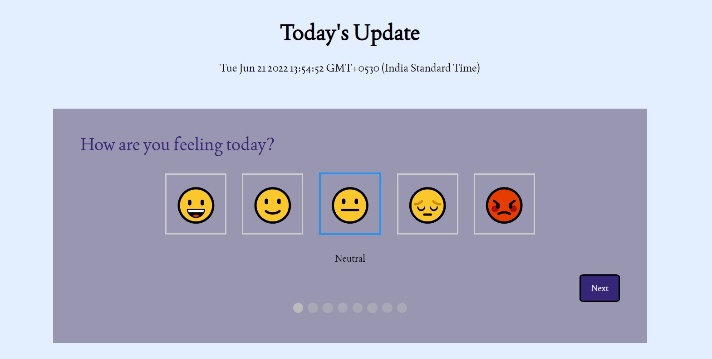
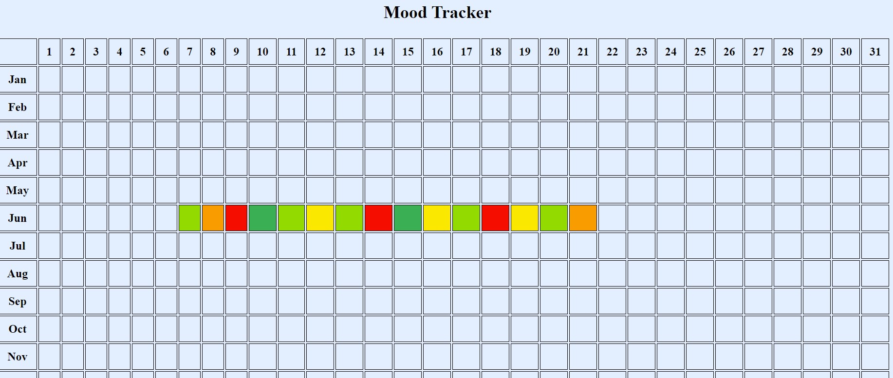

<!-- PROJECT SHIELDS -->
<!--
*** I'm using markdown "reference style" links for readability.
*** Reference links are enclosed in brackets [ ] instead of parentheses ( ).
*** See the bottom of this document for the declaration of the reference variables
*** for contributors-url, forks-url, etc. This is an optional, concise syntax you may use.
*** https://www.markdownguide.org/basic-syntax/#reference-style-links
-->


<!-- PROJECT LOGO -->
<br />
<div align="center">

  <h3 align="center">Euphoria</h3>

  <p align="center">
    A project to keep your mental health in check!
    <br />
    <a href="https://github.com/nimisha-sara/Euphoria/issues">Report Bug</a>
    ·
    <a href="https://github.com/nimisha-sara/Euphoria/issues">Request Feature</a>
  </p>
</div>


<!-- TABLE OF CONTENTS -->
<details>
  <summary>Table of Contents</summary>
  <ol>
    <li>
      <a href="#about-the-project">About The Project</a>
      <ul>
        <li><a href="#built-with">Built With</a></li>
      </ul>
    </li>
    <li>
      <a href="#getting-started">Getting Started</a>
      <ul>
        <li><a href="#prerequisites">Prerequisites</a></li>
        <li><a href="#installation">Installation</a></li>
      </ul>
    </li>
<!--     <li><a href="#usage">Usage</a></li> -->
    <li><a href="#roadmap">Roadmap</a></li>
<!--     <li><a href="#contributing">Contributing</a></li> -->
<!--     <li><a href="#license">License</a></li> -->
<!--     <li><a href="#contact">Contact</a></li> -->
<!--     <li><a href="#acknowledgments">Acknowledgments</a></li> -->
  </ol>
</details>


<!-- ABOUT THE PROJECT -->
## About The Project

<!-- [![Product Name Screen Shot][product-screenshot]](https://example.com) -->

Mental health is a major problem in the United States, as evidenced by terrible statistics. When we consider that the Centers for Disease Control and Prevention (CDC) estimates that one in every five adults suffers from a mental health illness at some point during the year, it's difficult to dispute that we need to make mental health awareness a higher priority.

Unfortunately, anything related to mental health has a big stigma, which is why it's critical that we recognise effective mental health initiatives and try to eliminate the hurdles that have been erected to prevent us from treating mental health in a positive, constructive manner. Allowing yourself to tune is something you should do on a regular basis.

This project allows its users to keep a daily journal and view thier stress and mood in a year chart. It also gives a list of activities to calm them. A word cloud is further used to visualize their journal.





<p align="right">(<a href="#top">back to top</a>)</p>


### Built With

* Flask
* Python
* HTML/CSS
* Javascript
* GoogleAuth
* Bootstrap
* JQuery

<p align="right">(<a href="#top">back to top</a>)</p>


<!-- GETTING STARTED -->
## Getting Started

This is an example of how you may give instructions on setting up your project locally.
To get a local copy up and running follow these simple example steps.

### Prerequisites

This is an example of how to list things you need to use the software and how to install them.
* python 3.7 or higher

### Installation

_Below is an example of how you can instruct your audience on installing and setting up your app. This template doesn't rely on any external dependencies or services._

1. Get a free Google Auth API Key at [https://developers.google.com](https://developers.google.com/identity/protocols/oauth2)
2. Clone the repo
   ```sh
   git clone https://github.com/nimisha-sara/Euphoria.git
   ```
3. Install python libraries
   ```sh
   pip install -r requirements.txt
   ```
4. Run the app.py file

<p align="right">(<a href="#top">back to top</a>)</p>


<!-- ROADMAP -->
## Roadmap

- [x] Add Journal Form and link to DB
- [x] Add Google Auth
- [x] Add Previous Journal View
- [x] Add Daily Journal Word Cloud
- [x] Add mood and stress view in pixels


<p align="right">(<a href="#top">back to top</a>)</p>
